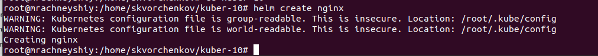
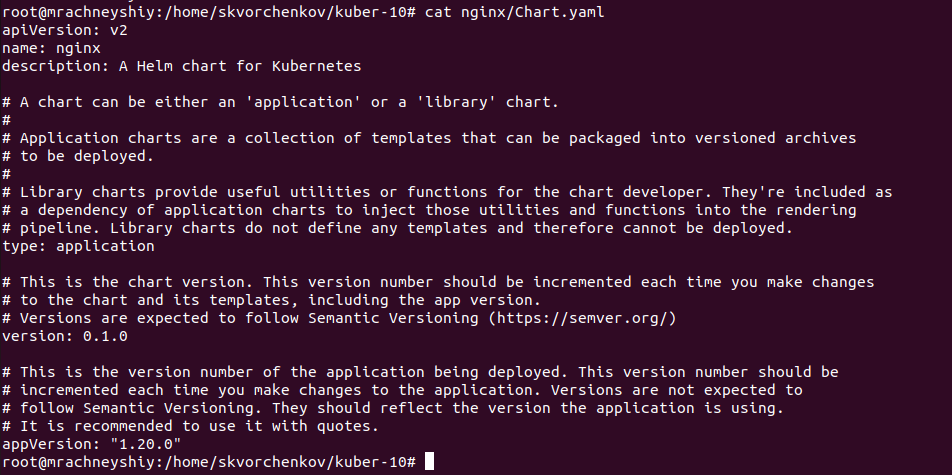
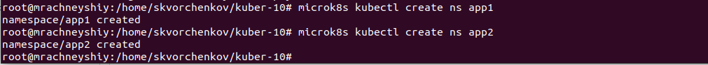
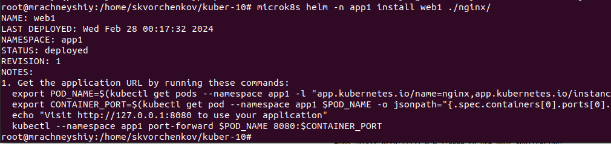
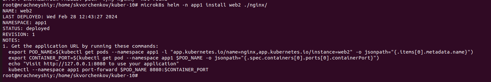
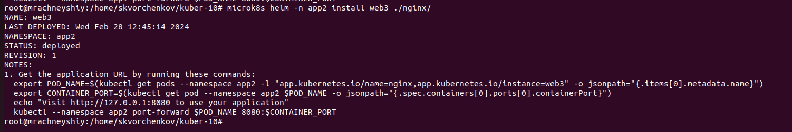
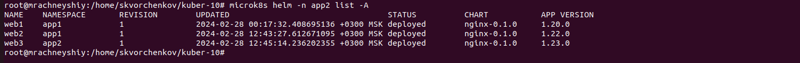

# Домашнее задание к занятию «Helm»

### Цель задания

В тестовой среде Kubernetes необходимо установить и обновить приложения с помощью Helm.

------

### Чеклист готовности к домашнему заданию

1. Установленное k8s-решение, например, MicroK8S.
2. Установленный локальный kubectl.
3. Установленный локальный Helm.
4. Редактор YAML-файлов с подключенным репозиторием GitHub.

------

### Инструменты и дополнительные материалы, которые пригодятся для выполнения задания

1. [Инструкция](https://helm.sh/docs/intro/install/) по установке Helm. [Helm completion](https://helm.sh/docs/helm/helm_completion/).

------

### Задание 1. Подготовить Helm-чарт для приложения

1. Необходимо упаковать приложение в чарт для деплоя в разные окружения. 
2. Каждый компонент приложения деплоится отдельным deployment’ом или statefulset’ом.
3. В переменных чарта измените образ приложения для изменения версии.

### Ответ на задание 1:



Поменял версию на 1.20.0



```bash
root@mrachneyshiy:/home/skvorchenkov/kuber-10# helm template nginx
WARNING: Kubernetes configuration file is group-readable. This is insecure. Location: /root/.kube/config
WARNING: Kubernetes configuration file is world-readable. This is insecure. Location: /root/.kube/config
---
# Source: nginx/templates/serviceaccount.yaml
apiVersion: v1
kind: ServiceAccount
metadata:
  name: release-name-nginx
  labels:
    helm.sh/chart: nginx-0.1.0
    app.kubernetes.io/name: nginx
    app.kubernetes.io/instance: release-name
    app.kubernetes.io/version: "1.20.0"
    app.kubernetes.io/managed-by: Helm
automountServiceAccountToken: true
---
# Source: nginx/templates/service.yaml
apiVersion: v1
kind: Service
metadata:
  name: release-name-nginx
  labels:
    helm.sh/chart: nginx-0.1.0
    app.kubernetes.io/name: nginx
    app.kubernetes.io/instance: release-name
    app.kubernetes.io/version: "1.20.0"
    app.kubernetes.io/managed-by: Helm
spec:
  type: ClusterIP
  ports:
    - port: 80
      targetPort: http
      protocol: TCP
      name: http
  selector:
    app.kubernetes.io/name: nginx
    app.kubernetes.io/instance: release-name
---
# Source: nginx/templates/deployment.yaml
apiVersion: apps/v1
kind: Deployment
metadata:
  name: release-name-nginx
  labels:
    helm.sh/chart: nginx-0.1.0
    app.kubernetes.io/name: nginx
    app.kubernetes.io/instance: release-name
    app.kubernetes.io/version: "1.20.0"
    app.kubernetes.io/managed-by: Helm
spec:
  replicas: 1
  selector:
    matchLabels:
      app.kubernetes.io/name: nginx
      app.kubernetes.io/instance: release-name
  template:
    metadata:
      labels:
        helm.sh/chart: nginx-0.1.0
        app.kubernetes.io/name: nginx
        app.kubernetes.io/instance: release-name
        app.kubernetes.io/version: "1.20.0"
        app.kubernetes.io/managed-by: Helm
    spec:
      serviceAccountName: release-name-nginx
      securityContext:
        {}
      containers:
        - name: nginx
          securityContext:
            {}
          image: "nginx:1.20.0"
          imagePullPolicy: IfNotPresent
          ports:
            - name: http
              containerPort: 80
              protocol: TCP
          livenessProbe:
            httpGet:
              path: /
              port: http
          readinessProbe:
            httpGet:
              path: /
              port: http
          resources:
            {}
---
# Source: nginx/templates/tests/test-connection.yaml
apiVersion: v1
kind: Pod
metadata:
  name: "release-name-nginx-test-connection"
  labels:
    helm.sh/chart: nginx-0.1.0
    app.kubernetes.io/name: nginx
    app.kubernetes.io/instance: release-name
    app.kubernetes.io/version: "1.20.0"
    app.kubernetes.io/managed-by: Helm
  annotations:
    "helm.sh/hook": test
spec:
  containers:
    - name: wget
      image: busybox
      command: ['wget']
      args: ['release-name-nginx:80']
  restartPolicy: Never

```


------
### Задание 2. Запустить две версии в разных неймспейсах

1. Подготовив чарт, необходимо его проверить. Запуститe несколько копий приложения.
2. Одну версию в namespace=app1, вторую версию в том же неймспейсе, третью версию в namespace=app2.
3. Продемонстрируйте результат.

### Ответ на задание 2:







[Nginx](nginx/)

### Правила приёма работы

1. Домашняя работа оформляется в своём Git репозитории в файле README.md. Выполненное домашнее задание пришлите ссылкой на .md-файл в вашем репозитории.
2. Файл README.md должен содержать скриншоты вывода необходимых команд `kubectl`, `helm`, а также скриншоты результатов.
3. Репозиторий должен содержать тексты манифестов или ссылки на них в файле README.md.